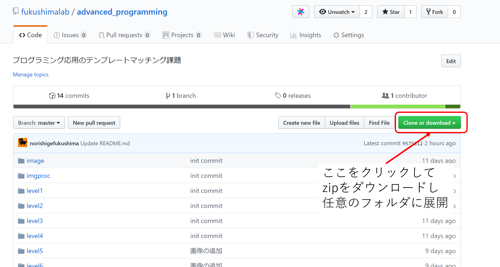

# プログラミング応用
名古屋工業大学情報工学科3年 プログラミング応用講義資料 テンプレートマッチング課題用プログラム

[説明資料（途中で読み込みが止まるので，右クリックしてダウンロードを推奨）](./docs/advanced_programming_signal_processing.pdf)

## Todo for 2024
- [] finalをたくさん作ってどこかを選ぶ形に変更．

## 達成目標
ある目的を達成するには，すべての機能を一つの言語だけでプログラムする必要はない．

本課題では，画像処理において，特定の画像が入っているかどうか検査するテンプレートマッチングを，以下3つの機能を組み合わせることを実現する．

* c言語プログラム
* ImageMagick
* シェルスクリプト

C言語プログラムでは，テンプレートマッチング自体が実装してある．
ImageMagickは簡単な画像処理を行う，コマンドラインベースのプログラムである．
シェルスクリプトは，上記二つをうまく呼び出すように結合されコマンドを連続で打つためのスクリプトである．

それぞれを工夫することで，最短時間で高い検出率を達成することを目指す．

## マニュアル
1. advanced_programming_signal_processingdディレクトリに移動
```shell
cd advanced_programming_signal_processing
```

2. makeでC言語プログラムのmatchingを生成
```shell
make
```

3. level1のテンプレートマッチングを実行（1~7は演習次第でかえる）
```shell
time sh run.sh level1
```

4. 結果をチェック
```shell
sh answer.sh result level1
```

引数は2つでresultを忘れがちなので注意．

5. ファイルの編集
* Makefileを編集コンパイルオプションの変更
* run.shを編集して，ImageMagickやmatchingの引数を変更
* main.cを編集してテンプレートマッチングの関数を変更

変更の後，2～4の繰り返し．

## ダウンロード方法



## ディレクトリ構成
* advanced_programming_signal_processing
	* 演習の本体
	* advanced_programming_signal_processing.slnでmatching関数をVisual Studioでも編集できる．
		* ソリューションのデバックには，この引数を指定してある．`imgproc/level1_000.ppm  level1/ocean_beach_kinzokutanchi.ppm 0 1.0 cp`
	* ただし，make でコンパイルが基本
* docs
	* 説明用のパワーポイントやpdfファイルが入ってる
* dataset
	* 演習のためのデータセットを作るプログラム（演習するときは必要ない）

# 備考
エラーが閾値以下の場合に，ファイルを書き込む仕様である．
つまり，閾値以下のものが2つ以上あった場合，どちらを正解とするかを判断する機構がないため，2つ以上の閾値以下の値を見つけた場合は，エラーになる可能性がある．


CSE: ~2022春まで
 Xeon® Platinum 8160 24/48 x8ソケット 192 core /384 thread
 ベースクロック 2.10 GHz　ターボ 3.70 GHz
 メモリ：いっぱい．
[詳細](https://www.intel.co.jp/content/www/jp/ja/products/sku/120501/intel-xeon-platinum-8160-processor-33m-cache-2-10-ghz/specifications.html)
